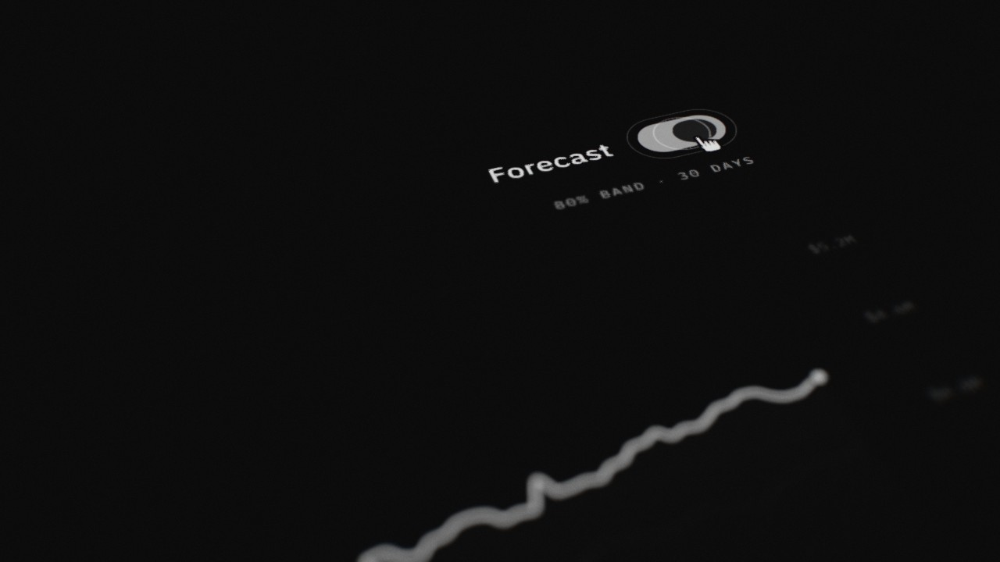
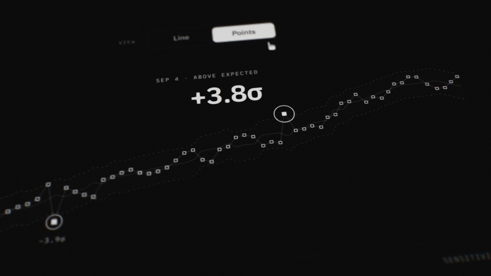
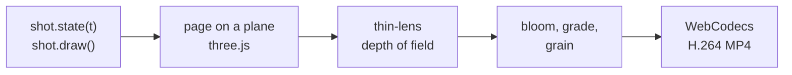

<p align="center">
  
</p>

<h1 align="center">Focal Plane</h1>

<p align="center">
  2.5D motion UI in the browser.<br>
  Flat interfaces, a real lens, hard cuts, rendered frame by frame to 4K60.
</p>

<p align="center">
  <b>English</b> · <a href="README.ru.md">Русский</a> · <a href="README.zh.md">中文</a>
</p>

<p align="center">
  <a href="https://e-nicko.github.io/focal-plane/"><b>▶ Live player</b></a> ·
  <a href="docs/en/README.md">Documentation</a> ·
  <a href="skills/focal-plane/SKILL.md">Agent skill</a>
</p>

---

**2.5D motion UI** is flat vector interface graphics
assembled and animated in three-dimensional space.
Depth of field gives it material presence:
the interface looks like an object filmed with a macro lens.
It is the look of app promos, product launch films and dashboard showcases.

Focal Plane makes it with code.
An interface is drawn with canvas 2D on a plane,
a camera with a thin-lens model flies over it,
focus moves from what the cursor touches to what that touch changes,
and every frame is a function of time,
rendered in the browser and encoded to MP4.

The repository has three parts:

- **the engine and an example film**, sixteen seconds about a fictional revenue dashboard;
- **an agent skill** that teaches an agent to make films like it;
- **the documentation**: the craft, and how we know what we claim about it,
  in English, Russian and Chinese.

## Quick start

The player is live on GitHub Pages: [open it](https://e-nicko.github.io/focal-plane/).
To run everything locally you need [Bun](https://bun.sh) 1.2 or newer and Google Chrome.

```bash
bun install
bun run serve
```

Open http://127.0.0.1:8790.
Space plays and pauses, the arrows step half a second, H hides the controls.
**Render MP4** makes the master in the browser.

From the command line:

```bash
bun run render                                   # out/focal-plane-2160p60.mp4
bun run verify out/focal-plane-2160p60.mp4       # decodes frames from the file
bun run shoot --t=1,5,9 --sheet                  # stills and a contact sheet
```

The tools drive your installed Google Chrome with the GPU
(set `CHROME_PATH` if it lives in an unusual place).
On an RTX 3060 Ti the 4K60 master takes about a minute.

## The film

Seven shots, hard cuts, one idea each.

| | Shot | The idea |
|---|---|---|
|  | **overview** · 2.1 s | the page; focus finds the headline number |
|  | **tabs** · 1.8 s | the hand glides along the tabs and picks Forecast |
|  | **forecast** · 2.5 s | a toggle, and the projection grows out of today |
|  | **horizon** · 2.3 s | a slider from 30 to 90 days; the value rolls to $5.24M |
|  | **months** · 2.4 s | a click on a month; a giant readout rolls to it |
|  | **anomaly** · 2.6 s | line to points; two days fall outside the band |
|  | **outro** · 2.4 s | the page again, after the story |

The numbers agree across shots,
and a detector finds the outliers in the data
([honest data](docs/en/honest-data.md)).

## How a frame is made



A shot is a plain object:
a page size, camera keys, `state(t)` for everything that moves,
and `draw()` for the page.
See [the pipeline](docs/en/pipeline.md).

## The skill

`skills/focal-plane/` is a skill for coding agents:
the grammar as rules, the APIs, a verification loop, the pitfalls, and tested templates.
An agent writes a shot, renders stills, looks at them, and corrects the camera,
the same loop a motion designer runs in After Effects.

For Claude Code, copy it where skills are found:

```bash
cp -r skills/focal-plane ~/.claude/skills/        # every project
cp -r skills/focal-plane .claude/skills/          # this repository only
```

Other agents can read `skills/focal-plane/SKILL.md` directly;
it is plain Markdown with a short front matter.
Then ask for a film: *"a 2.5D promo of our settings page: dark, one toggle per shot, 12 seconds"*.

## Documentation

**The craft:**
[what 2.5D motion UI is](docs/en/what-is-2.5d-motion-ui.md) ·
[the shot](docs/en/the-shot.md) ·
[the lens](docs/en/the-lens.md) ·
[the cursor](docs/en/the-cursor.md) ·
[the edit](docs/en/the-edit.md) ·
[the look](docs/en/the-look.md)

**Why it works, and how we know:**
[why it works](docs/en/why-it-works.md) ·
[every frame is computed](docs/en/computed-not-generated.md) ·
[honest data](docs/en/honest-data.md) ·
[how we know](docs/en/how-we-know.md) ·
[what it can't do](docs/en/limits.md)

**Building:**
[the pipeline](docs/en/pipeline.md) ·
[make your own film](docs/en/make-your-own.md) ·
[glossary](docs/glossary.md) ·
[sources](docs/sources.md)

## Repository

```
src/kit/             type, controls, cursor, easing
src/engine/          camera, lens, pipeline, player, MP4 export
src/film/            the example: data, seven shots, the edit
tools/               server, Chrome client, shoot, render, verify, timings, media, build
skills/focal-plane/  the agent skill
docs/                English, Russian and Chinese
fonts/               IBM Plex (SIL Open Font License)
media/               the cover and the stills, made by tools/media.ts
```

## Contributing

Short pages, one question each, with [Semantic Line Breaks](https://sembr.org/).
Every frame stays a function of time, and `bun run typecheck` stays clean.
Details in [CONTRIBUTING.md](CONTRIBUTING.md).

## License

Code under the [MIT License](LICENSE).
IBM Plex under the SIL Open Font License, three.js and mp4-muxer under MIT:
see [NOTICE.md](NOTICE.md).
