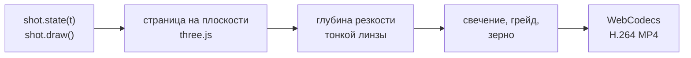

<p align="center">
  
</p>

<h1 align="center">Focal Plane</h1>

<p align="center">
  2.5D UI-моушен в браузере.<br>
  Плоские интерфейсы, настоящий объектив, жёсткие склейки, покадровый рендер в 4K60.
</p>

<p align="center">
  <a href="README.md">English</a> · <b>Русский</b> · <a href="README.zh.md">中文</a>
</p>

<p align="center">
  <a href="https://e-nicko.github.io/focal-plane/"><b>▶ Живой плеер</b></a> ·
  <a href="docs/ru/README.md">Документация</a> ·
  <a href="skills/focal-plane/SKILL.md">Скилл для агентов</a>
</p>

---

**2.5D motion UI**, или 2.5D UI-моушен, — это плоская векторная графика интерфейса,
которую собирают и анимируют в трёхмерном пространстве.
Глубина резкости придаёт ей материальность:
интерфейс выглядит как предмет, снятый на макрообъектив.
Так выглядят промо приложений, ролики запуска продуктов и шоукейсы дашбордов.

Focal Plane делает такие ролики кодом.
Интерфейс рисуется в canvas 2D на плоскости,
над ней пролетает камера с моделью тонкой линзы,
фокус переходит с того, чего касается курсор, на то, что это касание меняет,
а каждый кадр — функция времени:
он рендерится в браузере и кодируется в MP4.

Репозиторий состоит из трёх частей:

- **движок и пример фильма** — шестнадцать секунд о вымышленном дашборде выручки;
- **скилл для агентов**, который учит агента делать такие же фильмы;
- **документация**: ремесло и то, на чём основаны наши утверждения о нём,
  на английском, русском и китайском.

## Быстрый старт

Плеер работает и на GitHub Pages: [откройте его](https://e-nicko.github.io/focal-plane/).
Чтобы запустить всё у себя, понадобятся [Bun](https://bun.sh) версии 1.2 или новее и Google Chrome.

```bash
bun install
bun run serve
```

Откройте http://127.0.0.1:8790.
Пробел — воспроизведение и пауза, стрелки — шаг в полсекунды, H прячет элементы управления.
Кнопка **Render MP4** делает мастер-копию в браузере.

Из командной строки:

```bash
bun run render                                   # out/focal-plane-2160p60.mp4
bun run verify out/focal-plane-2160p60.mp4       # декодирует кадры из файла
bun run shoot --t=1,5,9 --sheet                  # стоп-кадры и контактный лист
```

Инструменты управляют установленным у вас Google Chrome и используют GPU
(если Chrome лежит в необычном месте, задайте `CHROME_PATH`).
На RTX 3060 Ti мастер-копия 4K60 делается примерно за минуту.

## Фильм

Семь планов, жёсткие склейки, в каждом плане одна идея.

| | План | Идея |
|---|---|---|
|  | **overview** · 2,1 с | страница; фокус находит главное число |
|  | **tabs** · 1,8 с | рука скользит по вкладкам и выбирает Forecast |
|  | **forecast** · 2,5 с | переключатель, и прогноз вырастает из сегодняшнего дня |
|  | **horizon** · 2,3 с | слайдер с 30 до 90 дней; значение прокручивается до $5,24 млн |
|  | **months** · 2,4 с | клик по месяцу; огромное табло прокручивается к нему |
|  | **anomaly** · 2,6 с | линия сменяется точками; два дня выпадают из коридора |
|  | **outro** · 2,4 с | снова страница, уже после истории |

Числа сходятся от плана к плану,
а выбросы в данных находит детектор
([честные данные](docs/ru/honest-data.md)).

## Как делается кадр



План — это обычный объект:
размер страницы, ключи камеры, `state(t)` для всего, что движется,
и `draw()` для самой страницы.
Подробнее — в разделе [«Конвейер»](docs/ru/pipeline.md).

## Скилл

`skills/focal-plane/` — скилл для агентов, которые пишут код:
грамматика в виде правил, API, цикл проверки, подводные камни и проверенные шаблоны.
Агент пишет план, рендерит стоп-кадры, смотрит на них и поправляет камеру —
тот же цикл, что проходит моушен-дизайнер в After Effects.

Для Claude Code скопируйте его туда, где лежат скиллы:

```bash
cp -r skills/focal-plane ~/.claude/skills/        # для всех проектов
cp -r skills/focal-plane .claude/skills/          # только для этого репозитория
```

Другие агенты могут читать `skills/focal-plane/SKILL.md` напрямую:
это обычный Markdown с короткой шапкой front matter.
Затем попросите фильм: *«2.5D-промо нашей страницы настроек: тёмное, по одному переключателю на план, 12 секунд»*.

## Документация

**Ремесло:**
[что такое 2.5D UI-моушен](docs/ru/what-is-2.5d-motion-ui.md) ·
[план](docs/ru/the-shot.md) ·
[объектив](docs/ru/the-lens.md) ·
[курсор](docs/ru/the-cursor.md) ·
[монтаж](docs/ru/the-edit.md) ·
[изображение](docs/ru/the-look.md)

**Почему это работает и откуда мы это знаем:**
[почему это работает](docs/ru/why-it-works.md) ·
[каждый кадр вычислен](docs/ru/computed-not-generated.md) ·
[честные данные](docs/ru/honest-data.md) ·
[откуда мы знаем](docs/ru/how-we-know.md) ·
[чего метод не умеет](docs/ru/limits.md)

**Сборка:**
[конвейер](docs/ru/pipeline.md) ·
[сделайте свой фильм](docs/ru/make-your-own.md) ·
[глоссарий](docs/glossary.md) ·
[источники](docs/sources.md)

## Репозиторий

```
src/kit/             типографика, элементы управления, курсор, функции плавности
src/engine/          камера, объектив, конвейер, плеер, экспорт в MP4
src/film/            пример: данные, семь планов, монтаж
tools/               сервер, клиент Chrome, shoot, render, verify, timings, media, build
skills/focal-plane/  скилл для агентов
docs/                английский, русский и китайский
fonts/               IBM Plex (SIL Open Font License)
media/               обложка и стоп-кадры, их делает tools/media.ts
```

## Участие

Короткие страницы, по одному вопросу на каждую, с [семантическими переносами строк](https://sembr.org/).
Каждый кадр остаётся функцией времени, а `bun run typecheck` проходит без ошибок.
Подробности — в [CONTRIBUTING.ru.md](CONTRIBUTING.ru.md).

## Лицензия

Код распространяется по [лицензии MIT](LICENSE).
IBM Plex — по SIL Open Font License, three.js и mp4-muxer — по MIT:
подробности в [NOTICE.md](NOTICE.md).
