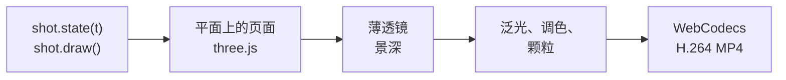

<p align="center">
  
</p>

<h1 align="center">Focal Plane</h1>

<p align="center">
  浏览器里的 2.5D 动态 UI。
  <br>扁平界面、真实的镜头光学、硬切，逐帧渲染到 4K60。
</p>

<p align="center">
  <a href="README.md">English</a> · <a href="README.ru.md">Русский</a> · <b>中文</b>
</p>

<p align="center">
  <a href="https://e-nicko.github.io/focal-plane/"><b>▶ 在线播放器</b></a> ·
  <a href="docs/zh/README.md">文档</a> ·
  <a href="skills/focal-plane/SKILL.md">智能体技能</a>
</p>

---

**2.5D motion UI**（2.5D 动态 UI）指的是扁平的矢量界面图形，
在三维空间中组装并制作动画。
景深赋予它实体感：
界面看起来就像一件用微距镜头拍摄的物体。
应用宣传片、产品发布片和仪表盘展示片，用的都是这种画面。

Focal Plane 用代码来制作它。
界面用 canvas 2D 绘制在一个平面上，
一台采用薄透镜模型的相机从它上方飞过，
焦点从光标触碰的地方移到这次触碰所改变的地方，
每一帧都是时间的函数，
在浏览器中渲染并编码为 MP4。

仓库由三部分组成：

- **引擎和一部示例影片**，16 秒，讲一个虚构的营收仪表盘；
- **一个智能体技能**，教智能体制作同类影片；
- **文档**：技法本身，以及我们对它的各项说法依据何在，
  提供英文、俄文和中文版本。

## 快速开始

播放器也部署在 GitHub Pages 上：[直接打开](https://e-nicko.github.io/focal-plane/)。
要在本地运行全部内容，需要 [Bun](https://bun.sh) 1.2 或更新版本，以及 Google Chrome。

```bash
bun install
bun run serve
```

打开 <http://127.0.0.1:8790>。
空格键播放和暂停，方向键每次步进半秒，H 键隐藏控制栏。
**Render MP4** 按钮在浏览器中生成母版。

在命令行中：

```bash
bun run render                                   # out/focal-plane-2160p60.mp4
bun run verify out/focal-plane-2160p60.mp4       # 从文件本身解码帧
bun run shoot --t=1,5,9 --sheet                  # 静帧和联系表
```

这些工具会启动你本机安装的 Google Chrome 并启用 GPU（如果 Chrome 装在不常见的位置，请设置 `CHROME_PATH`）。
在 RTX 3060 Ti 上，4K60 母版大约需要一分钟。

## 影片

七个镜头，硬切，每个镜头一个想法。

| | 镜头 | 想法 |
|---|---|---|
|  | **overview** · 2.1 秒 | 页面；焦点找到核心数字 |
|  | **tabs** · 1.8 秒 | 手沿着标签页滑过，选中 Forecast |
|  | **forecast** · 2.5 秒 | 一个开关，预测曲线从今天长出来 |
|  | **horizon** · 2.3 秒 | 滑块从 30 天拖到 90 天；数值滚动到 $5.24M |
|  | **months** · 2.4 秒 | 点击一个月份；巨大的读数滚动到这个月的值 |
|  | **anomaly** · 2.6 秒 | 折线切换为散点；有两天落在区间之外 |
|  | **outro** · 2.4 秒 | 故事讲完，再回到页面 |

各个镜头中的数字彼此一致，
离群值由检测器从数据中找出（[诚实的数据](docs/zh/honest-data.md)）。

## 一帧是怎样生成的



一个镜头就是一个普通对象：
页面尺寸、相机关键帧、描述一切运动的 `state(t)`，
以及绘制页面的 `draw()`。
详见[渲染管线](docs/zh/pipeline.md)。

## 技能

`skills/focal-plane/` 是给编程智能体用的技能：
写成规则的语法、各个 API、一个验证循环、常见陷阱，以及经过测试的模板。
智能体写一个镜头，渲染静帧，查看静帧，再修正相机，
这和动态设计师在 After Effects 里反复做的循环是同一个。

对于 Claude Code，把它复制到技能的查找路径下：

```bash
cp -r skills/focal-plane ~/.claude/skills/        # 所有项目
cp -r skills/focal-plane .claude/skills/          # 仅限本仓库
```

其他智能体可以直接读取 `skills/focal-plane/SKILL.md`；
它是普通的 Markdown，开头有一小段 front matter。
然后请它做一部影片：*“给我们的设置页做一支 2.5D 宣传片：暗色，每个镜头一个开关，12 秒”*。

## 文档

**技法**：
[什么是 2.5D 动态 UI](docs/zh/what-is-2.5d-motion-ui.md) ·
[镜头](docs/zh/the-shot.md) ·
[镜头光学](docs/zh/the-lens.md) ·
[光标](docs/zh/the-cursor.md) ·
[剪辑](docs/zh/the-edit.md) ·
[画面](docs/zh/the-look.md)

**为什么有效，我们又如何知道**：
[为什么有效](docs/zh/why-it-works.md) ·
[每一帧都是计算出来的](docs/zh/computed-not-generated.md) ·
[诚实的数据](docs/zh/honest-data.md) ·
[我们如何知道](docs/zh/how-we-know.md) ·
[它做不到什么](docs/zh/limits.md)

**构建**：
[渲染管线](docs/zh/pipeline.md) ·
[制作你自己的影片](docs/zh/make-your-own.md) ·
[术语表](docs/glossary.md) ·
[来源](docs/sources.md)

## 仓库结构

```
src/kit/             排版、控件、光标、缓动
src/engine/          相机、透镜、管线、播放器、MP4 导出
src/film/            示例影片：数据、七个镜头、剪辑
tools/               服务器、Chrome 客户端、shoot、render、verify、timings、media、build
skills/focal-plane/  智能体技能
docs/                英文、俄文和中文文档
fonts/               IBM Plex（SIL Open Font License）
media/               封面和静帧，由 tools/media.ts 生成
```

## 参与贡献

页面要短，每页回答一个问题，采用[语义换行](https://sembr.org/)。
每一帧始终是时间的函数，
`bun run typecheck` 也始终没有报错。
详见 [CONTRIBUTING.zh.md](CONTRIBUTING.zh.md)。

## 许可证

代码采用 [MIT 许可证](LICENSE)。
IBM Plex 采用 SIL Open Font License，three.js 和 mp4-muxer 采用 MIT 许可证：
见 [NOTICE.md](NOTICE.md)。
