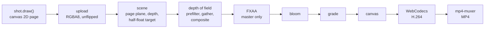

# The pipeline

From a canvas to an MP4, in one browser tab.

## Quality presets

| Preset | Page density | MSAA | DoF samples | Bloom levels | For |
|---|---|---|---|---|---|
| draft | 1.5× | 4× | 110 | 5 | composing, scrubbing |
| high | 2.5× | 4× | 260 | 6 | live playback, stills |
| master | 5× | none, FXAA | 720 | 6 | the MP4 |

Page density is canvas pixels per page pixel.
The master draws the page at 5×,
so type stays crisp when a 4K frame looks at a third of the page.

## Measured

RTX 3060 Ti, Chrome, Windows 11, 3840×2160, master preset,
from `bun run timings`,
as ranges over four runs at three moments of the film:

| Stage | GPU time per frame |
|---|---|
| scene: page upload and draw | 13–57 ms |
| depth of field | 16–20 ms |
| bloom | 2–5 ms |
| grade | 1–2.5 ms |

The scene stage moves most:
it includes drawing the 7000×4500 px page and uploading it,
and it follows the shot and the load on the machine.

Rendering and encoding together ran at about 16 frames per second:
the full sixteen-second film, 966 frames, took 59 seconds
and came out at 86 MB (45 Mbit/s).

## Lessons that cost time

- **The page upload.**
  An sRGB texture with `flipY` sends every upload through the CPU,
  which cost seconds per 4K frame.
  Plain RGBA8, unflipped and premultiplied, with the sRGB decode in the shader,
  keeps Chrome on its GPU-to-GPU copy path.
- **MSAA at 4K.**
  Multisampling a half-float target at 4K was about twenty times slower than not,
  so the master uses FXAA instead.
- **`gl.finish()` is a flush in Chrome.**
  It waits for nothing, so to time a stage, read back one pixel.
- **WebCodecs needs a secure context.**
  It exists only on `https://` and on loopback addresses (`localhost`, `127.0.0.1`);
  the tools serve on `127.0.0.1` for that reason.
- **Seeking a `<video>` needs HTTP ranges,**
  and the `seeked` event can arrive before the new frame is shown.
  `bun run verify` waits for the frame itself, with a timeout.
- **Fonts before frames.**
  Shots measure text, so the player loads every face before the first frame.

## The capture API

With `?capture&w=<width>&h=<height>` in the URL,
the player renders nothing on its own and exposes `window.__film`:

| Member | What it does |
|---|---|
| `duration`, `fps`, `shots` | the edit: length, frame rate, shot ids and start times |
| `setSize(w, h)` | the output size in pixels |
| `setQuality(q)` | `draft`, `high` or `master` |
| `setGrade(o)` | overrides of the grade, such as `{ grain: 0 }`; `{}` restores the edit's grade |
| `renderAt(t, frame)` | renders the frame at time `t` |
| `shot(t, type, q)` | renders and returns a data URL |
| `timings(t)` | GPU milliseconds per stage for the frame at `t` |
| `exportMP4(opts)` | renders and encodes a range, returns a `Blob` |

## The cover GIF

`bun run media` renders the cover at twice its size and scales it down,
with grain and chromatic aberration off.
Its 63 greys are placed by 1D k-means on the frames' histogram.
After the first frame, pixels within two grey levels of what is already shown stay transparent,
so each frame stores only what changed.
The result: 800×450, 132 frames, under 3 MB.

Next: [make your own film](make-your-own.md).
