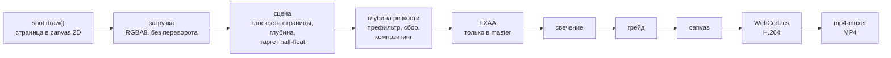

# Конвейер

От canvas до MP4 в одной вкладке браузера.

## Пресеты качества

| Пресет | Плотность страницы | MSAA | Сэмплы ГРИП | Уровни свечения | Для чего |
|---|---|---|---|---|---|
| draft | 1,5× | 4× | 110 | 5 | композиция, перемотка |
| high | 2,5× | 4× | 260 | 6 | живое воспроизведение, стоп-кадры |
| master | 5× | нет, FXAA | 720 | 6 | итоговый MP4 |

Плотность страницы — это число пикселей canvas на один пиксель страницы.
В пресете master страница рисуется в 5×,
чтобы текст оставался чётким, когда кадр 4K смотрит на треть страницы.

## Замеры

RTX 3060 Ti, Chrome, Windows 11, 3840×2160, пресет master,
по данным `bun run timings`,
диапазоны за четыре запуска в трёх моментах фильма:

| Этап | Время GPU на кадр |
|---|---|
| сцена: загрузка и отрисовка страницы | 13–57 мс |
| глубина резкости | 16–20 мс |
| свечение | 2–5 мс |
| грейд | 1–2,5 мс |

Этап сцены колеблется сильнее всех:
в него входят отрисовка страницы 7000×4500 px и её загрузка,
и он зависит от плана и от нагрузки на машину.

Рендер и кодирование вместе шли со скоростью 16–20 кадров в секунду:
полный шестнадцатисекундный фильм, 966 кадров, занял 59 и 47 секунд в двух запусках
и дал файл на 86 МБ (45 Мбит/с).

## Уроки, стоившие времени

- **Загрузка страницы.**
  Текстура sRGB с `flipY` отправляет каждую загрузку через CPU,
  и это стоило секунд на каждый кадр 4K.
  Обычный RGBA8, без переворота и с предумноженной альфой, с декодированием sRGB в шейдере,
  удерживает Chrome на пути копирования GPU → GPU.
- **MSAA в 4K.**
  Мультисэмплинг half-float-таргета в 4K был примерно в двадцать раз медленнее, чем без него,
  поэтому в master вместо него используется FXAA.
- **`gl.finish()` в Chrome — это flush.**
  Он ничего не ждёт, поэтому для замера этапа прочитайте с GPU один пиксель.
- **WebCodecs нужен безопасный контекст.**
  Он доступен только на `https://` и на адресах обратной петли (`localhost`, `127.0.0.1`);
  поэтому инструменты и поднимают сервер на `127.0.0.1`.
- **Для перемотки `<video>` нужны HTTP range-запросы,**
  а событие `seeked` может прийти раньше, чем покажется новый кадр.
  `bun run verify` ждёт сам кадр, с таймаутом.
- **Шрифты до кадров.**
  Планы измеряют текст, поэтому плеер загружает все начертания до первого кадра.

## API захвата

Если в URL есть `?capture&w=<width>&h=<height>`,
плеер сам ничего не рендерит и открывает доступ к `window.__film`:

| Поле или метод | Что делает |
|---|---|
| `duration`, `fps`, `shots` | монтаж: длительность, частота кадров, id планов и время их начала |
| `setSize(w, h)` | выходной размер в пикселях |
| `setQuality(q)` | `draft`, `high` или `master` |
| `setGrade(o)` | переопределения грейда, например `{ grain: 0 }`; `{}` возвращает грейд монтажа |
| `renderAt(t, frame)` | рендерит кадр в момент `t` |
| `shot(t, type, q)` | рендерит кадр и возвращает data URL |
| `timings(t)` | миллисекунды GPU по этапам для кадра в момент `t` |
| `exportMP4(opts)` | рендерит и кодирует диапазон, возвращает `Blob` |

## GIF-обложка

`bun run media` рендерит обложку в двойном размере и уменьшает её,
с выключенными зерном и хроматической аберрацией.
63 оттенка серого в её палитре расставлены одномерным k-means по гистограмме кадров.
Начиная со второго кадра, пиксели,
которые отличаются от уже показанного не больше чем на два уровня серого,
остаются прозрачными,
так что каждый кадр хранит только то, что изменилось.
Итог: 800×450, 132 кадра, меньше 3 МБ.

Дальше: [сделайте свой фильм](make-your-own.md).
