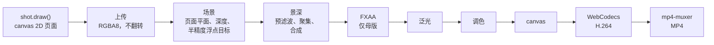

# 渲染管线

从 canvas 到 MP4，全在一个浏览器标签页里完成。

## 质量预设

| 预设 | 页面密度 | MSAA | 景深采样数 | 泛光层级 | 用途 |
|---|---|---|---|---|---|
| draft | 1.5× | 4× | 110 | 5 | 构图、拖动时间轴预览 |
| high | 2.5× | 4× | 260 | 6 | 实时播放、静帧 |
| master | 5× | 无，改用 FXAA | 720 | 6 | 输出 MP4 |

页面密度是每个页面像素对应的 canvas 像素数。
母版以 5× 绘制页面，
所以即使 4K 画面只看到页面的三分之一，文字也依然锐利。

## 实测

RTX 3060 Ti，Chrome，Windows 11，3840×2160，master 预设，
数据来自 `bun run timings`，
为影片三个时刻各测四次得到的范围：

| 阶段 | 每帧 GPU 耗时 |
|---|---|
| 场景：页面上传与绘制 | 13–57 毫秒 |
| 景深 | 16–20 毫秒 |
| 泛光 | 2–5 毫秒 |
| 调色 | 1–2.5 毫秒 |

场景阶段的波动最大：
它包含绘制 7000×4500 px 的页面并上传，
数值随镜头和机器负载而变。

渲染和编码合计约 16 帧每秒：
完整的 16 秒影片共 966 帧，用了 59 秒，
输出文件 86 MB（45 Mbit/s）。

## 花了时间才学到的教训

- **页面上传**。
  带 `flipY` 的 sRGB 纹理会让每次上传都经过 CPU，
  每个 4K 帧因此要多花好几秒。
  改用普通的 RGBA8，不翻转、预乘 alpha，在着色器里做 sRGB 解码，
  Chrome 就会一直走 GPU 到 GPU 的拷贝路径。
- **4K 下的 MSAA**。
  在 4K 下对半精度浮点渲染目标做多重采样，比不做慢大约二十倍，
  所以母版改用 FXAA。
- **`gl.finish()` 在 Chrome 里只是一次 flush**。
  它什么也不等待，所以要给某个阶段计时，就回读一个像素。
- **WebCodecs 需要安全上下文**。
  它只存在于 `https://` 和回环地址（`localhost`、`127.0.0.1`）下；
  所以工具在 `127.0.0.1` 上提供服务。
- **在 `<video>` 中跳转需要 HTTP Range 请求**，
  而且 `seeked` 事件可能在新帧显示之前就到达。
  `bun run verify` 会等待帧本身出现，并设有超时。
- **先加载字体，再出帧**。
  镜头要测量文字，所以播放器在第一帧之前加载全部字体。

## 捕获 API

URL 中带上 `?capture&w=<width>&h=<height>` 时，
播放器不再自行渲染，只暴露出 `window.__film`：

| 成员 | 作用 |
|---|---|
| `duration`, `fps`, `shots` | 剪辑信息：时长、帧率、镜头 id 和起始时间 |
| `setSize(w, h)` | 以像素为单位的输出尺寸 |
| `setQuality(q)` | `draft`、`high` 或 `master` |
| `setGrade(o)` | 覆盖调色参数，例如 `{ grain: 0 }`；`{}` 恢复剪辑本身的调色 |
| `renderAt(t, frame)` | 渲染时刻 `t` 的帧 |
| `shot(t, type, q)` | 渲染并返回 data URL |
| `timings(t)` | 时刻 `t` 那一帧各阶段的 GPU 耗时（毫秒） |
| `exportMP4(opts)` | 渲染并编码一段时间范围，返回 `Blob` |

## 封面 GIF

`bun run media` 以两倍尺寸渲染封面，再缩小，
渲染时关闭颗粒和色差。
它的 63 级灰由各帧直方图上的一维 k-means 确定。
第一帧之后，与已显示内容相差不超过两个灰阶的像素保持透明，
所以每一帧只存储变化的部分。
结果：800×450，132 帧，小于 3 MB。

下一篇：[制作你自己的影片](make-your-own.md)。
